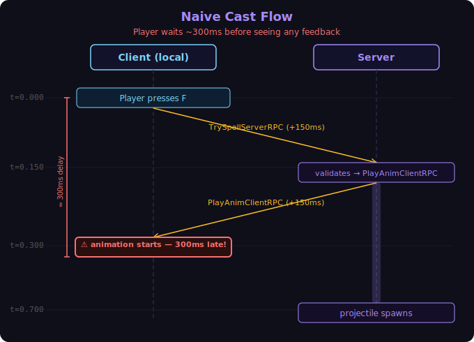
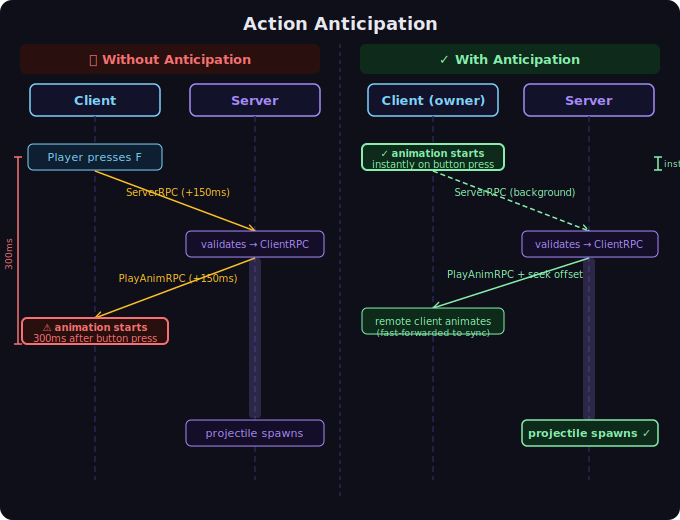
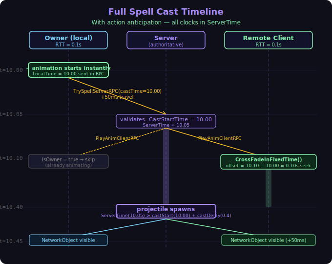
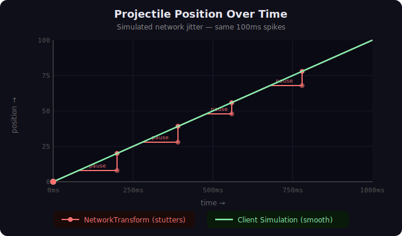
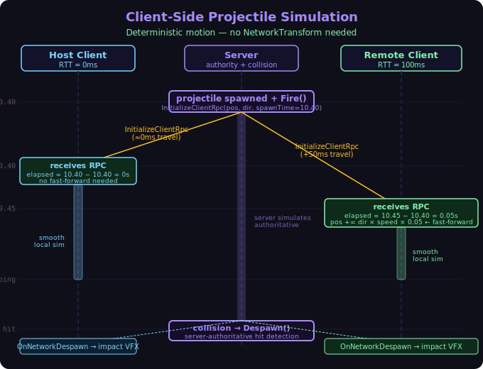

<!-- _class: title -->

# Networked Spells
## What AI taught me about latency, action anticipation, and deterministic projectiles

---

# The Setup

Building a **1v1 networked spell duel** in Unity using Netcode for GameObjects (NGO)

- Two players cast spells at each other
- Spells have **wind-up animations** before the projectile spawns
- The opponent needs to **see the wind-up** to react and dodge

Sounds simple. It wasn't.

---

# Attempt 1 — The Naive Flow

```
Player presses F
    → Cast() called on client
    → TrySpellServerRPC sent to server
    → Server validates
    → Server sends PlayAnimationClientRPC back
    → Client plays animation
    → Server waits castDelay seconds
    → Server spawns projectile
```

This seems correct. Let's add some network delay and see what happens.

---


# Attempt 1 — What It Felt Like

```
t = 0.000   Player presses F
t = 0.150   Server receives RPC  (+150ms travel)
t = 0.150   Server validates, sends PlayAnimationClientRPC
t = 0.300   Client receives RPC  (+150ms travel back)
t = 0.300   ← animation finally starts
t = 0.700   Projectile spawns
```

**300ms of nothing after pressing F.**

The player pressed a button and the game ignored them for nearly a third of a second.
It felt broken.

---

# Attempt 1 — What It Felt Like



---

# Action Anticipation

> "Don't wait for the server to tell you something happened.  
> **Predict it locally. Correct if wrong.**"

Unity Docs — *Dealing with Latency*

The classic example: **throwing a grenade**

---

# Grenade — Without Action Anticipation

```
Player pulls pin
    → RPC to server (+150ms)
    → Server validates
    → ClientRPC back (+150ms)
    → Animation plays ← 300ms late
```

The grenade arc animation lags behind the input.
The player feels disconnected from their own character.

---

# Grenade — With Action Anticipation

```
Player pulls pin
    → Play animation IMMEDIATELY  ← instant feedback
    → RPC to server (+150ms)
    → Server validates
    → Tell OTHER clients to play animation (fast-forwarded)
    → Server spawns grenade at correct time
```

The local player gets **instant feedback**.
The server is still authoritative — it just catches up.

---

# Applying This to Spells

```csharp
public void Cast(SpellNameEnum spellNameEnum)
{
    // Quick local checks (null, state, cooldown)
    // ...

    // 1. Start animation IMMEDIATELY — no waiting
    PlayLocalAnimation(spell);

    // 2. Send LocalTime timestamp with the RPC
    TrySpellServerRPC(spellNameEnum, NetworkManager.LocalTime.Time);
}
```

The player sees their cast animation the **same frame** they press the button.

---



---

# LocalTime vs ServerTime

Unity NGO maintains two clocks per client:

| Clock | Where it runs | Offset |
|-------|--------------|--------|
| `LocalTime` | **Client** | **Ahead** **of server by ~RTT/2** |
| `ServerTime` | **Client** | **Behind** **server by ~RTT/2** |

**Rule:**
- Client sends `LocalTime` in RPCs to server
- Everyone compares against `ServerTime` when receiving

The lead of `LocalTime` cancels the travel delay — the timestamp arrives at the server at roughly the right moment.

---

# Remote Client — Fast-Forward the Animation

The remote player's client receives `PlayAnimationClientRPC` **after** the cast started.
We fast-forward into the animation using `CrossFadeInFixedTime`:

```csharp
[ClientRpc]
private void PlayAnimationClientRPC(SpellNameEnum spellNameEnum, double castTime)
{
    if (IsOwner) return; // already started locally

    float offset = (float)(NetworkManager.ServerTime.Time - castTime);
    offset = Mathf.Clamp(offset, 0f, spell.castDelay - 0.05f);

    characterAnimator.CrossFadeInFixedTime(
        stateName,
        0.05f,   // short blend
        -1,
        offset   // seek this many seconds into the animation
    );
}
```

All three machines see the animation **in sync**.

---

# The Full Spell Timeline

```
t = 10.00   Owner presses F → animation starts instantly
t = 10.00   TrySpellServerRPC sent (LocalTime = 10.0)

t = 10.05   Server receives RPC (ServerTime ≈ 10.0)
t = 10.05   Server validates, stores CastStartTime = 10.0
t = 10.05   PlayAnimationClientRPC sent to all clients

t = 10.10   Remote client receives RPC (ServerTime ≈ 10.1)
t = 10.10   offset = 0.1s → CrossFade seeks 0.1s in ✓

t = 10.40   Server: ServerTime >= CastStartTime + castDelay
t = 10.40   Projectile spawns ✓
```

---



---

# Problem 2 — Projectile Jitter

Projectile position was synced via **NetworkTransform**.

Under network jitter:
- Server sends position updates with inconsistent timing
- NetworkTransform interpolates between stale positions
- Remote player sees the projectile **stutter** — stop briefly, then lurch forward

```
Real path:    ───────────────────────>
Client sees:  ──── · · ─────── · · ──>
```

Hard to dodge something that moves like that.

---



---

# Why NetworkTransform Fails for Projectiles

NetworkTransform is designed for **unpredictable motion** — characters, vehicles, things that turn and accelerate.

A spell projectile is **deterministic**:
- Fixed start position ✓
- Fixed direction ✓  
- Fixed speed ✓

You don't need to sync position every tick.
You just need to sync the **initial conditions once**.

---

# Solution — Client-Side Simulation

```
Server spawns projectile → sends ClientRpc with:
    - spawnPosition
    - direction  
    - spawnTime (ServerTime)

Each client receives the RPC at (spawnTime + RTT/2)
Client fast-forwards position:
    elapsed = ServerTime.Now - spawnTime
    position = spawnPosition + direction * speed * elapsed

Client simulates locally from that point → perfectly smooth
```

The server's projectile handles **collision and damage**.
The client's projectile handles **visuals**.
They travel identically because the physics is deterministic.

---

# The Client RPC

```csharp
[ClientRpc]
public void InitializeClientRpc(
    Vector3 spawnPosition, 
    Vector3 direction, 
    double spawnTime)
{
    if (IsServer) return; // server already initialized

    // fast-forward to account for travel time
    float elapsed = (float)(NetworkManager.ServerTime.Time - spawnTime);
    transform.position = spawnPosition + direction * speed * elapsed;
    rb.linearVelocity = direction * speed;
}
```

Remove `NetworkTransform` from the projectile prefab entirely.
`OnNetworkDespawn` still fires on all clients — impact VFX still works.

---



---

# Fairness — Who Gets Hit?

Collision runs **server-side only** (`CanDestroy()` gate).

The server has one authoritative projectile position.
What clients *see* is cosmetic — the hitbox is on the server.

The remaining edge case: player dodges visually but server registers a hit
because the **player's own position** lags via NetworkTransform.

Mitigation options:
- **Small projectile collider** — cheapest, feels fair
- **Server-side lag compensation** — rewind player position by RTT on hit check
- **Client-authoritative hit detection** — complex, opens cheat vectors

For a spell duel: **shrink the collider**.

---

# What I Learned

1. **Never wait for a server round-trip before giving player feedback**
   → Action anticipation feels like a superpower once you use it

2. **Understand your clocks** — `LocalTime` and `ServerTime` are different for a reason
   → Client sends `LocalTime`, receivers compare against `ServerTime`

3. **NetworkTransform is not always the right tool**
   → Deterministic motion = simulate locally, sync initial conditions only

4. **Test as the remote client, not the host**
   → The host's RTT=0 hides almost every networking bug

---

<!-- _class: title -->

# Questions?

*"The host is always lying to you about how good your netcode is."*